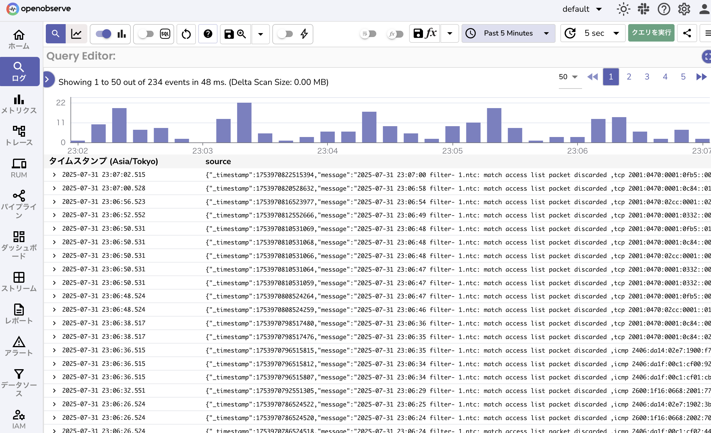

# NTT のレンタル HGW (PR-400NE) からログを取り出す

## 構成

<pre>
   ┌─────────┐    ┌──────┐    ┌───────┐   
   │         │    │Vector│    │Open   │   
   │ NTT HGW ├◄───┼(HTTP │    │Observe│   
   │         │    │ GET) ┼───►│       │   
   └─────────┘    └──────┘    └───────┘   
                   Remap,                 
                   Dedupe                 
</pre>

## やっていること

PR-400NE の管理画面で見える各種のログは、http://${NTT_HGW_ADDRESS}/index.cgi/system_inf.log といった URL を HTTP GET で呼び出すことでダウンロードできる。

出力されるログの行数が多いとすぐに流れてしまうので、定期的に Vector で上記の URL からログメッセージを取得し、取得済みのものと重複しているものを取り除いた上で、OpenObserve に対してログを転送して保管する。

## スクリーンショット

